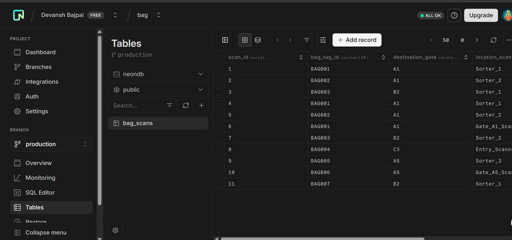
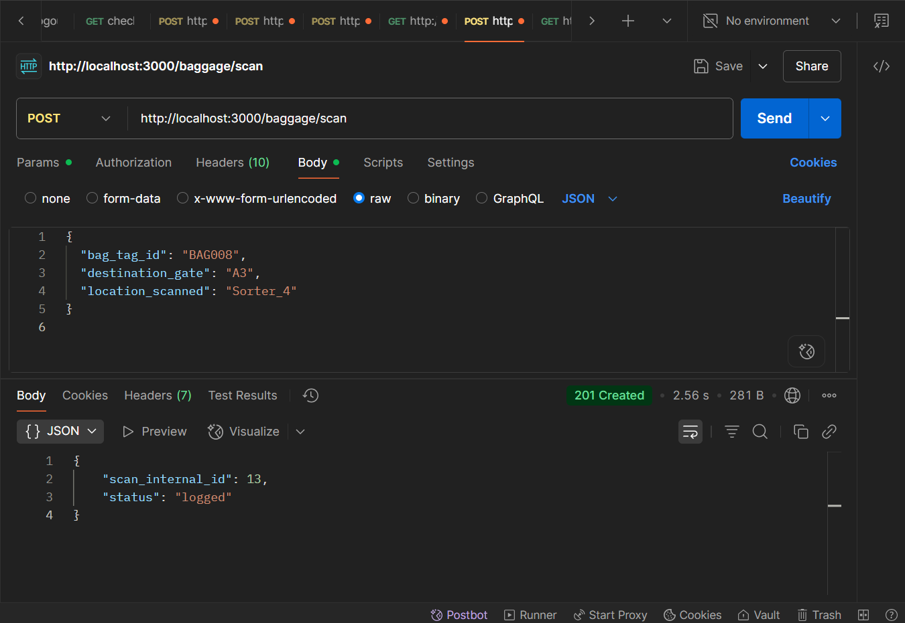

# 🧳 Airport Baggage Tracking API

A Node.js + PostgreSQL backend to track baggage scan events in an airport system in real-time.




---

## 🚀 Features

- Log a baggage scan 📦
- Track scans for a bag by ID 🧾
- Track bags en-route to specific gates 🛫
- Count unique bags scanned per gate 📊

---

## 🏗️ Tech Stack

- **Backend**: Node.js + Express
- **Database**: PostgreSQL (Neon DB recommended)
- **Environment**: `.env` for config management

---

## 🛠️ Setup Instructions

### 1. Clone the repo

```bash
git clone https://github.com/DevanshBajpai09/baggaes.git
cd baggage-tracking-api
```

## 📮 API Endpoints

### ✅ POST /baggage/scan

**Request**

```bash
{
  "bag_tag_id": "BAG001",
  "destination_gate": "A5",
  "location_scanned": "Sorter_1"
}

```

**Response**

```bash
{
  "scan_internal_id": 1,
  "status": "logged"
}

```

### ✅ GET /baggage/scans/bag/:bag_tag_id

**Example URL:**

```bash
GET /baggage/scans/bag/BAG001


```

**Response**

```bash
[
  {
    "scan_id": 1,
    "bag_tag_id": "BAG001",
    "destination_gate": "A5",
    "location_scanned": "Sorter_1",
    "scanned_at": "2025-07-19T08:23:00.000Z"
  },
  ...
]


```

### ✅ GET /baggage/scans/bag/:bag_tag_id?latest=true

**Example URL:**

```bash
GET /baggage/scans/bag/BAG001?latest=true


```

**Response**

```bash
{
  "scan_id": 3,
  "bag_tag_id": "BAG001",
  "destination_gate": "A5",
  "location_scanned": "Belt_1",
  "scanned_at": "2025-07-19T10:45:00.000Z"
}


```

### ✅ GET /baggage/scans/gate/:destination_gate

**Example URL:**

```bash
GET /baggage/scans/gate/A5


```

**Response**

```bash
[
  {
    "scan_id": 4,
    "bag_tag_id": "BAG004",
    "destination_gate": "A5",
    "location_scanned": "Belt_1",
    "scanned_at": "2025-07-19T09:00:00.000Z"
  },
  ...
]


```

### ✅ GET /baggage/active/gate/:destination_gate?since_minutes=N

**Example URL:**

```bash
GET /baggage/active/gate/A5?since_minutes=30


```

**Response**

```bash
[
  {
    "bag_tag_id": "BAG001",
    "last_scan_at": "2025-07-19T10:00:00.000Z",
    "last_location": "Sorter_3"
  },
  ...
]


```

### ✅ GET /baggage/stats/gate-counts?since_minutes=N

**Example URL:**

```bash
GET /baggage/stats/gate-counts?since_minutes=60


```

**Response**

```bash
[
  {
    "destination_gate": "A5",
    "unique_bag_count": 3
  },
  {
    "destination_gate": "B2",
    "unique_bag_count": 2
  }
]


```
