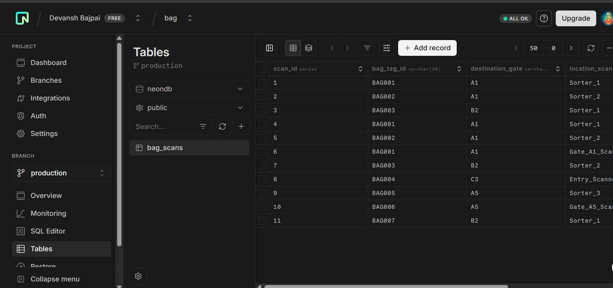

# 🧳 Airport Baggage Tracking API

A Node.js + PostgreSQL backend to track baggage scan events in an airport system in real-time.




---

## 🚀 Features

- Log a baggage scan 📦
- Track scans for a bag by ID 🧾
- Track bags en-route to specific gates 🛫
- Count unique bags scanned per gate 📊

---

## 🏗️ Tech Stack

- **Backend**: Node.js + Express
- **Database**: PostgreSQL (Neon DB recommended)
- **Environment**: `.env` for config management

---

## 🛠️ Setup Instructions

### 1. Clone the repo
```bash
git clone https://github.com/your-username/baggage-tracking-api.git
cd baggage-tracking-api
